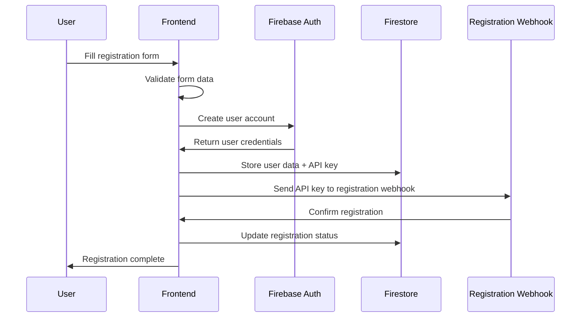
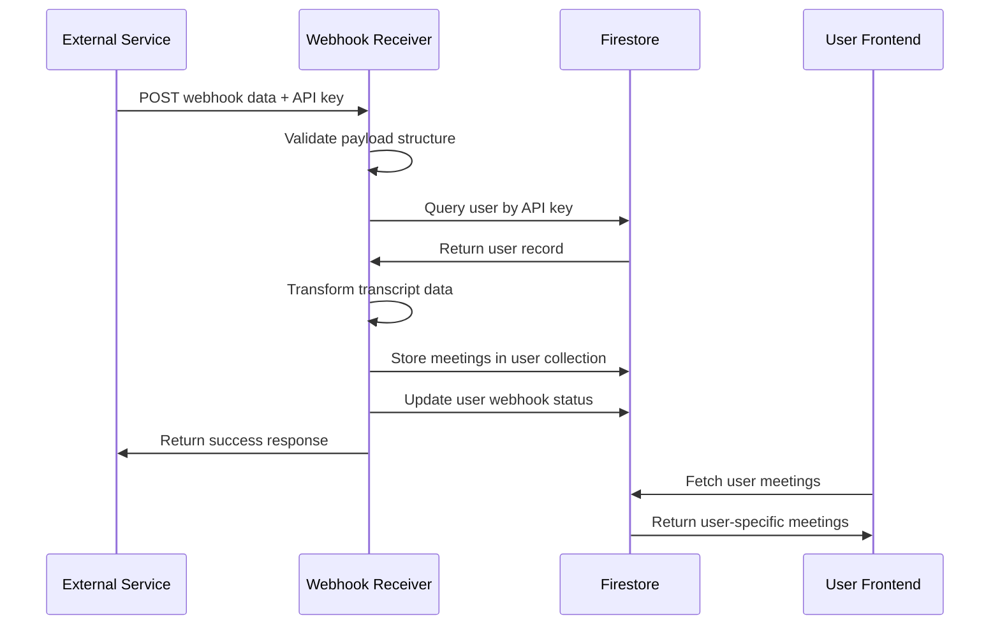

# MeetingMind - Technical Documentation

## System Architecture Overview

### 🏗️ **Complete User Registration and Webhook Integration Flow**

This document outlines the comprehensive technical implementation for user registration, API key management, and webhook data processing.

---

## 📊 **Database Schema Design**

### Firebase Firestore Structure

```
/users/{userId}
├── email: string
├── displayName: string
├── firefliesApiKey: string (unique identifier)
├── userId: string
├── registrationStatus: "pending" | "completed" | "webhook_failed"
├── webhookRegistered: boolean
├── webhookStatus: "active" | "inactive" | "error"
├── lastWebhookReceived: timestamp
├── totalMeetingsReceived: number
├── createdAt: timestamp
├── updatedAt: timestamp
└── /meetings/{meetingId}
    ├── id: string
    ├── title: string
    ├── date: string (YYYY-MM-DD)
    ├── duration: string
    ├── source: "webhook" | "manual"
    ├── originalDate: string (ISO format)
    ├── createdAt: timestamp
    └── updatedAt: timestamp
```

---

## 🔄 **Complete Flow Diagram**

### 1. User Registration Flow



### 2. Webhook Data Processing Flow



---

## 🛠️ **API Endpoint Specifications**

### Registration Webhook Endpoint
- **URL**: `https://flotech123.app.n8n.cloud/webhook/7eed2ed4-73cc-4584-af8c-fd5e1fa8db6f`
- **Method**: POST
- **Purpose**: Register user's Fireflies API key with external service

**Request Format:**
```json
{
  "FireFlies_API_KEY": "010a8b05-b6fa-4d34-bc82-cc8079682402",
  "action": "user_registration",
  "timestamp": "2025-01-15T10:00:00.000Z"
}
```

### Data Processing Webhook Endpoint
- **URL**: `{SUPABASE_URL}/functions/v1/webhook-receiver`
- **Method**: POST
- **Purpose**: Receive and process transcript data

**Request Format:**
```json
{
  "body": {
    "FireFlies_API_KEY": "010a8b05-b6fa-4d34-bc82-cc8079682402",
    "transcripts": [
      {
        "title": "Lets catch up",
        "id": "01K0HM4JSVA2VFFF5BJ62TCBRX",
        "date": "2025-07-19T15:20:00.000Z"
      },
      {
        "title": "Your meeting",
        "id": "01K0HJ3ZQ57WTAFKKVY4Q88WZQ",
        "date": "2025-07-19T14:45:00.000Z"
      }
    ]
  }
}
```

**Success Response:**
```json
{
  "success": true,
  "message": "Webhook processed successfully",
  "data": {
    "userId": "user123",
    "userEmail": "user@example.com",
    "meetingsProcessed": 2,
    "timestamp": "2025-01-15T10:00:00.000Z"
  },
  "meetings": [...]
}
```

---

## ✅ **Data Validation Rules**

### User Registration Validation
- **Email**: Valid email format, required
- **Password**: Minimum 6 characters, required
- **Fireflies API Key**: Non-empty string, required
- **Full Name**: Optional, defaults to email prefix

### Webhook Payload Validation
- **Payload Structure**: Must contain `body` object
- **API Key**: Must be present in `body.FireFlies_API_KEY`
- **Transcripts**: Must be array in `body.transcripts`
- **Transcript Fields**: Each must have `id`, `title`, `date`
- **Date Format**: Must be valid ISO 8601 timestamp

### Data Integrity Checks
- **Unique API Keys**: Each user must have unique Fireflies API key
- **Meeting IDs**: Duplicate meeting IDs are overwritten (upsert behavior)
- **Date Normalization**: All dates stored as YYYY-MM-DD format
- **User Association**: Meetings only stored for verified users

---

## 🚨 **Error Handling Procedures**

### Registration Errors
```typescript
// Registration webhook failure
{
  registrationStatus: "webhook_failed",
  webhookError: "Connection timeout",
  // User account still created, manual intervention required
}
```

### Webhook Processing Errors
```typescript
// Invalid API key
{
  success: false,
  error: "User not found",
  details: "No user found with the provided FireFlies_API_KEY"
}

// Malformed payload
{
  success: false,
  error: "Invalid payload structure",
  details: "Missing transcripts in payload.body"
}

// Storage failure
{
  success: false,
  error: "Storage failed",
  details: "Could not save meetings to database"
}
```

### Frontend Error Handling
- **Network Errors**: Retry mechanism with exponential backoff
- **Authentication Errors**: Redirect to login page
- **Data Loading Errors**: Fallback to cached/mock data
- **Webhook Errors**: Display user-friendly error messages

---

## 🔐 **Security Considerations**

### API Key Management
- **Storage**: Encrypted in Firestore
- **Transmission**: HTTPS only
- **Access**: User-specific, no cross-user access
- **Validation**: Server-side verification for all operations

### Data Privacy
- **User Isolation**: Each user's data stored in separate subcollections
- **Access Control**: Firebase security rules enforce user boundaries
- **Audit Trail**: All operations logged with timestamps
- **Data Retention**: Configurable retention policies

### Webhook Security
- **Payload Validation**: Strict schema validation
- **Rate Limiting**: Implemented at edge function level
- **Error Logging**: Comprehensive logging without exposing sensitive data
- **CORS**: Properly configured for cross-origin requests

---

## 📈 **Performance Optimizations**

### Database Optimization
- **Indexing**: Composite indexes on frequently queried fields
- **Batch Operations**: Bulk writes for multiple meetings
- **Caching**: Client-side caching of user data
- **Pagination**: Implemented for large meeting lists

### Webhook Processing
- **Async Processing**: Non-blocking operations
- **Batch Updates**: Multiple meetings processed in single transaction
- **Connection Pooling**: Efficient database connections
- **Error Recovery**: Automatic retry for transient failures

---

## 🧪 **Testing Procedures**

### Unit Tests
- User registration flow validation
- Webhook payload parsing and validation
- Data transformation accuracy
- Error handling scenarios

### Integration Tests
- End-to-end registration flow
- Webhook data processing pipeline
- Firebase security rules validation
- Cross-browser compatibility

### Load Testing
- Concurrent webhook processing
- Database performance under load
- Memory usage optimization
- Response time benchmarks

---

## 📋 **Deployment Checklist**

### Environment Setup
- [ ] Firebase project configured
- [ ] Supabase edge functions deployed
- [ ] Environment variables set
- [ ] CORS policies configured

### Security Configuration
- [ ] Firebase security rules deployed
- [ ] API key encryption enabled
- [ ] HTTPS certificates valid
- [ ] Rate limiting configured

### Monitoring Setup
- [ ] Error tracking enabled
- [ ] Performance monitoring active
- [ ] Webhook success/failure alerts
- [ ] Database usage monitoring

### Documentation
- [ ] API documentation updated
- [ ] User guides created
- [ ] Error code reference
- [ ] Troubleshooting guides

---

## 🔧 **Maintenance Procedures**

### Regular Maintenance
- **Database Cleanup**: Remove old/unused data
- **Log Rotation**: Archive old logs
- **Performance Review**: Monitor and optimize slow queries
- **Security Updates**: Keep dependencies updated

### Monitoring Alerts
- **High Error Rates**: Webhook processing failures
- **Database Performance**: Slow query alerts
- **Storage Limits**: Approaching quota warnings
- **User Registration Issues**: Failed registrations

### Backup Procedures
- **Daily Backups**: Automated Firestore backups
- **Configuration Backup**: Environment and security rules
- **Code Repository**: Version control with tags
- **Recovery Testing**: Regular restore procedures

---

This comprehensive system ensures reliable user registration, secure API key management, and robust webhook data processing with proper error handling and monitoring capabilities.